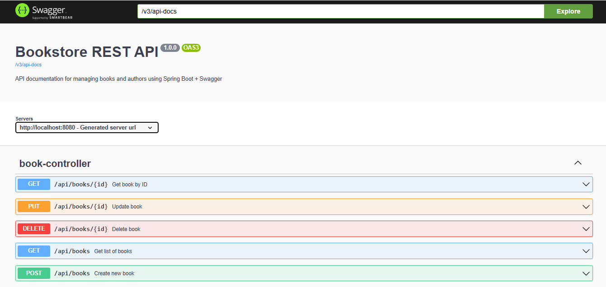
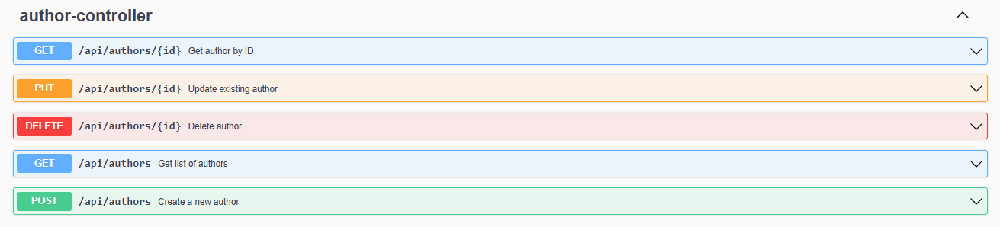

# 📚 RESTful Bookstore API

A **Spring Boot RESTful API** for managing **Books** and **Authors**.  
This project demonstrates full **CRUD operations**, **Swagger documentation**, and **H2 in-memory database** integration for easy testing.

---

## 🧰 Tech Stack

- **Java 17+**
- **Spring Boot 3.x**
- **Spring Data JPA**
- **H2 Database (In-memory)**
- **Swagger / OpenAPI 3**
- **Maven**
- **Postman** (for testing)

---

## 🚀 Features

✅ CRUD operations for Books and Authors  
✅ Search books by title or author  
✅ Integrated Swagger UI for easy API documentation  
✅ In-memory H2 database (no setup required)  
✅ Layered architecture: Controller → Service → Repository → Entity  
✅ Easy integration and lightweight configuration  

## 🧪 API Endpoints

### 📘 Book Endpoints

| **Method** | **Endpoint**         | **Description**           |
|-------------|----------------------|----------------------------|
| GET         | `/api/books`         | Get all books              |
| GET         | `/api/books/{id}`    | Get book by ID             |
| POST        | `/api/books`         | Add new book               |
| PUT         | `/api/books/{id}`    | Update existing book       |
| DELETE      | `/api/books/{id}`    | Delete book by ID          |

---

### ✍️ Author Endpoints

| **Method** | **Endpoint**           | **Description**             |
|-------------|------------------------|------------------------------|
| GET         | `/api/authors`         | Get all authors              |
| GET         | `/api/authors/{id}`    | Get author by ID             |
| POST        | `/api/authors`         | Add new author               |
| PUT         | `/api/authors/{id}`    | Update existing author       |
| DELETE      | `/api/authors/{id}`    | Delete author by ID          |

## 🧭 Swagger UI (API Documentation)

Swagger is automatically enabled when the application runs.
### 🖼️ 1. Swagger UI – Book Endpoints

### 🖼️ 2. Swagger UI – Author Endpoints

